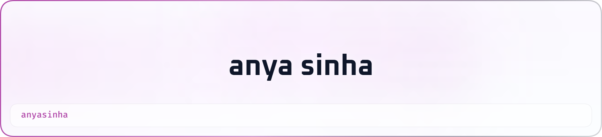
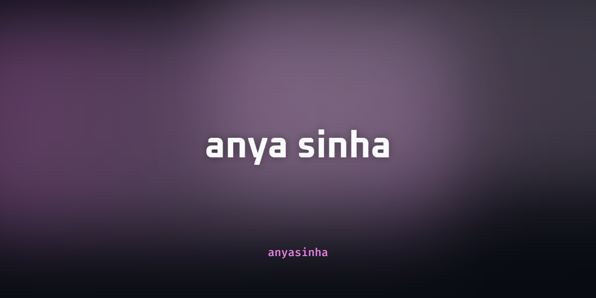

  <picture>
    <source media="(prefers-color-scheme: dark)" srcset="header-dark.png">
    <source media="(prefers-color-scheme: light)" srcset="header-light.png">
    
  </picture>

 

<h1 align="center">Hey there, I'm Anya! ♡</h1>

  

 

  
  &nbsp;
  
  &nbsp;
  

 
 

<h2 align="center">🌸 About Me</h2>

 

<table align="center" width="90%" border="0">
<tr>

<td width="65%" valign="middle">

<h3>Hi, I'm Anya! ♡</h3>

I'm a <b>Data Science & Business Administration</b> student passionate about combining technology, analytics, and business strategy.

I'm currently pursuing a dual-degree path involving <b>Data Science, Business Administration, and Management Information Systems</b>, with a growing interest in <b>Marketing Analytics</b>.

I love working at the intersection of:

<ul>
  <li>📊 Data Science & Machine Learning</li>
  <li>💼 Business & Strategy</li>
  <li>📣 Marketing Analytics</li>
  <li>💻 Technology & Information Systems</li>
  <li>🌱 Data-driven problem solving</li>
</ul>

I'm particularly interested in transforming messy datasets into insights that people can actually use.

 

<i>"Turning data into decisions, one model at a time."</i>

</td>

<td width="35%" align="center" valign="middle">

</td>

</tr>
</table>

 
 

<h2 align="center">📈 GitHub Analytics</h2>

 

  
  &nbsp;&nbsp;
  

 

  

 

  

 
 

<h2 align="center">🐍 Contribution Snake</h2>

 

  

 
 

<h2 align="center">💌 Let's Connect</h2>

 

&nbsp;

&nbsp;

 
 

  

